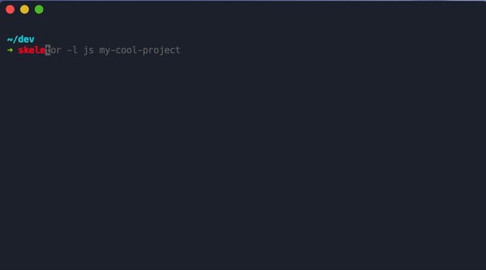

Init a project with the necessary ~~evils~~ files super fast.

## Getting Started

### Requirements

- jq

```bash
brew install jq
```

### Installation

```bash
$ git clone https://github.com/gretzky/skeletor && cd skeletor
$ make install
```

by default, it installs to `/usr/local`. you can change the prefix if necessary.

```bash
$ make PREFIX=$WHATEVER install
```

you can uninstall with `make uninstall`

run `skeletor -h` for a help menu.

### Usage



```bash
$ skeletor [-l <language>] [-L <license>] [project-name]
```

By default, skeletor will build a directory with a few standard files: editorconfig, gitignore, LICENSE, and a README.

The license defaults to MIT, you can pass the `-L` flag with an argument to get a different license. Supported licenses: AGPL, Apache2.0, BSD2, BSD, GPL2.0, GPL3.0, MIT, MPL2.0, and Unlicense. 

The gitignore utilizes the [gitignore.io](https://gitignore.io) api and will automatically build a config for your machine that covers your OS, your editor (if a default one is set or an editor is detected), and the language you chose.

### Language Support

Some languages will also initialize after your project is built.

**JS/TS**

Runs `npm` or `yarn` init, and `tsc --init` if you pass typescript.

**Python**

Adds a `requirements.txt` and sets up a virtualenv if virtualenv is globally installed.

**Rust**

Runs `cargo init`
